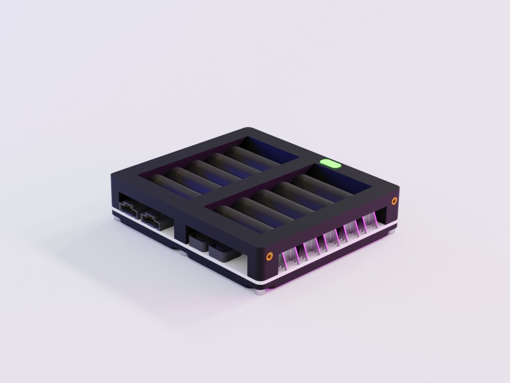

The Mechanical Project for the Wolley Battery Module
====================================================

A battery pack with integrated charger, protection, on/off switch, status LED
and monitoring of voltages, current and temperatures.

| Specification   |            |
| --------------- | ----------:|
| Number of cells |         10 |
| Cell type       | Ni-MH (AA) |

Parts
-----

### 3D Printable

| Qty | Part   | Material          | Part Number |
| ---:| ------ | ----------------- | -----------:|
|   1 | Base   | ABS, PET-G or PLA |      100137 |
|   1 | Top    | ABS, PET-G or PLA |      100138 |
|   1 | Button | ABS, PET-G or PLA |      100139 |

### Other Parts

| Qty | Part                                                         |
| ---:| ------------------------------------------------------------ |
|   6 | Socket Screw ISO 4762, M3 x 6 mm                             |
|  10 | Threaded Insert, M3 (Ruthex RX-M3x5.7)                       |
|   1 | Wolley BatteryECU v2.0 (100136)                              |
